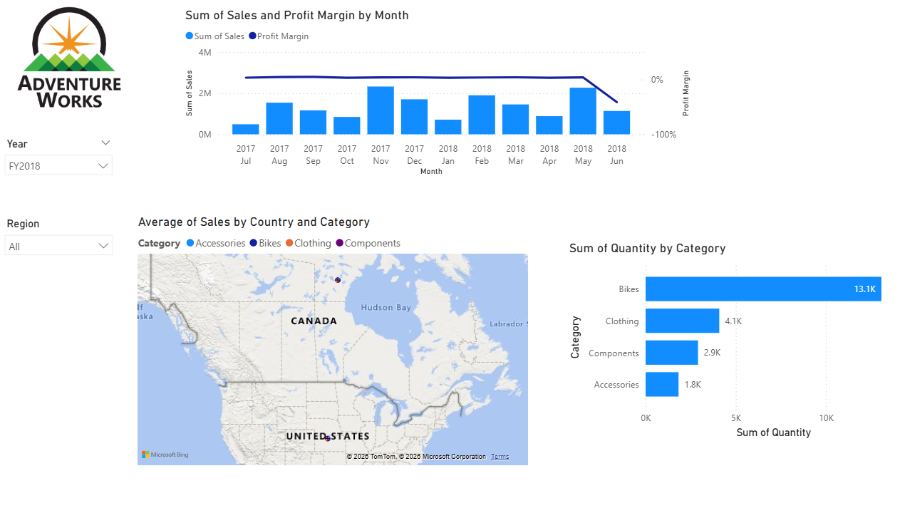

# Adventure-Works-Sales-Dashboard
Interactive Power BI dashboard for sales analysis and business insights.
# Adventure Works Sales Dashboard

## Overview
This project presents an interactive Power BI dashboard built using the Adventure Works dataset. The dashboard provides insights into sales performance, profitability, customer trends, and key business metrics through interactive visualizations.

## Features
- Sales Performance Analysis
- Profit Analysis
- KPI Monitoring
- Interactive Filters and Slicers
- Trend Analysis
- Data Visualization

## Tools & Technologies
- Power BI
- Data Modeling
- DAX
- Data Visualization

## Dashboard Insights
- Analyzed overall sales and profit performance.
- Identified top-performing products and categories.
- Monitored key business KPIs.
- Tracked sales trends over time.
- Supported data-driven decision-making through visual reports.

## Dashboard Preview

## Project Outcome
The dashboard helps stakeholders monitor business performance, identify growth opportunities, and make informed decisions using interactive and data-driven insights.
